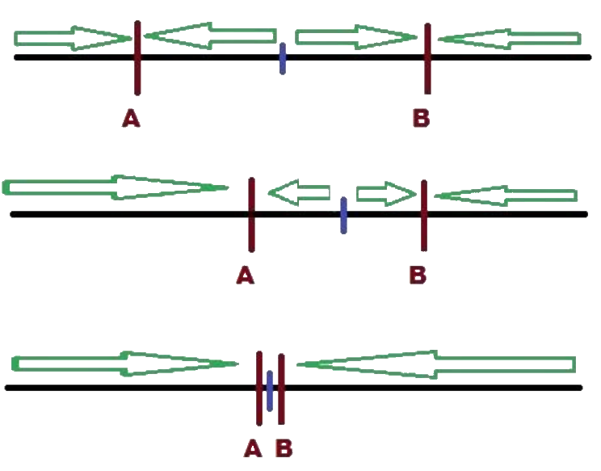

# Мороженщики на пляже
## Исходная игра «Мороженщики на пляже»

Два продавца мороженого (ј = 1, 2) одновременно определяют
местонахождение хј своей тележки на пляже. Пляж
рассматривается как единичный отрезок [0, 1]. Покупатели
распределены равномерно по длине пляжа. Они покупают
мороженое у ближайшего продавца. Продавец максимизирует
длину части пляжа, с которой к нему идут покупатели (и, тем
самым, свою прибыль - цена фиксирована).
Более конкретно, если координата продавца ј будет хј, а его
конкурента - х-ј, тогда его выигрыш в игре равен
```
               | (xj +x_j)/2, если хј < х_ј
uj(xj, x-j) =  | 1/2, если хј = x_ј
               | 1 - (xj + х-ј)/2, если хј > х_ј.
```
~ модель линейного города Хотеллинга (Hotelling, 1929)

## Анализ исходной игры «Мороженщики на пляже»


В игре существует единственное равновесие Нэша:

X1 = 1/2, X2 = 1/2

## Равновесие Нэша

(TBD)